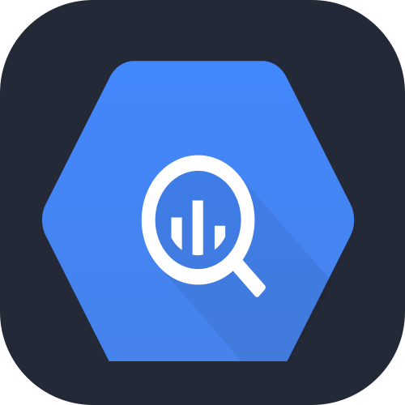
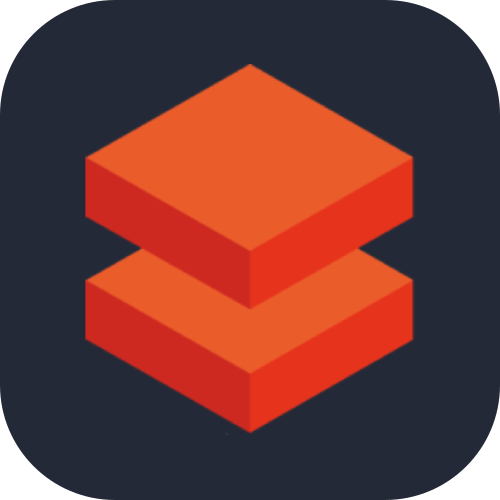
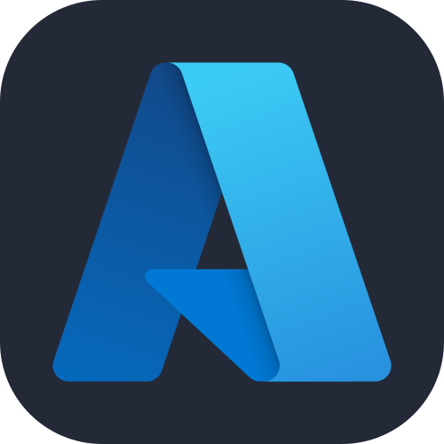
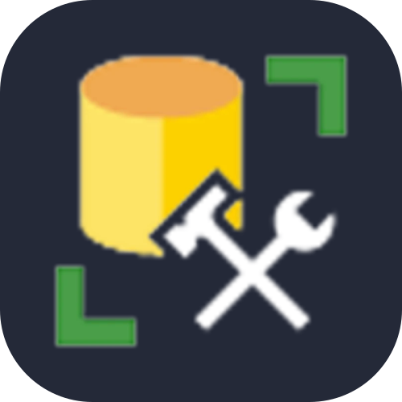
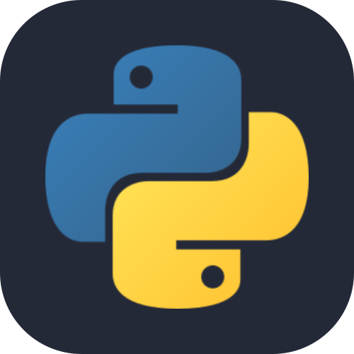
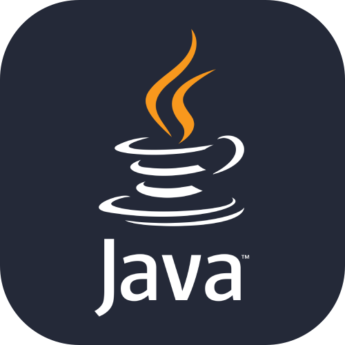

<!-- 

   
  
  
  
  
  

 -->

  <!-- 🗄️ Dados -->
  
  
  
  
  
  
  <!--  -->
  <!-- ☁️ Cloud -->
  
  
  
  <!--  -->
  <!-- 🛠️ Ferramentas de Desenvolvimento -->
  
  
  
  
  
  
   
  <!-- 👨‍💻 Linguagens -->
  
  
  
  
  
  
  
  <!--  -->
  <!-- 🚀 Frameworks e Plataformas -->
  
  
  
  
  <!--  -->
  <!-- 💻 Sistemas Operacionais -->
  
  
  
   
  <!-- 🔎 Ferramentas Forenses -->
  
  
  
  
  

<h3>Data Solutions</h3>

**E.Analytics - Electoral Campaign Intelligence Platform** \
🛠 `Python`, `Airflow`, `SQL`, `PostgreSQL`, `PowerBI`, `DAX`, `ETL/ELT`, `CI/CD` \
📁 [E.Analytics](https://github.com/puc-cc-tcc) \
ℹ️ End-to-end analytics product combining Bourdieu's Social Field Theory with data engineering. Ingests political content, identifies communication styles using AI models, maps symbolic capital, calculates audience adoption, and provides real-time effectiveness metrics via interactive dashboards.
 

**Quati** \
**Python Library** • Data engineering tools to accelerate development. \
🛠 `Python`, `PyPI` \
🐍 [quati](https://pypi.org/project/quati/)
 

<h3>Open Source</h3>

**Igmapper** \
**Python Library** • Get metrics (likes, comms, shares, profiles, posts, reels...) from Instagram. \
🛠 `Python`, `Instagram` \
🐍 [igmapper](https://pypi.org/project/igmapper/)
 

<h3>Academic</h3>

**PUC - Ciência da Computação | Portfolio** \
**Brazil** 🇧🇷 • Projects developed during the bachelor's degree in Computer Science - PUC Minas \
🛠 `Blender`, `C/C++`, `CoppeliaSim`, `Java`, `Lisp`, `Packet Tracer`, `Pascal`, `Prolog`, `Python`, `Shell`... \
📁 [puc-pc-cc](https://github.com/lucasoal/lucasoal/blob/main/puc-pc-cc.md)
 

**IPG - Engenharia Informática | Portfolio** \
**Portugal** 🇵🇹 • Projects developed during the bachelor's degree in Computer Engineering - IPG \
🛠 `Bootstrap`, `C/C#`, `CSS`, `HTML`, `Haskell`, `Ino`, `JavaScript`, `PL/SQL`, `Salesforce`, `Unity`... \
📁 [ipg-ei](https://github.com/lucasoal/lucasoal/blob/main/ipg-ei.md)
 
