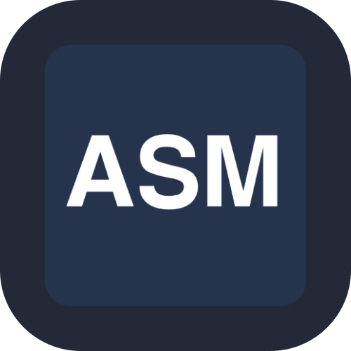
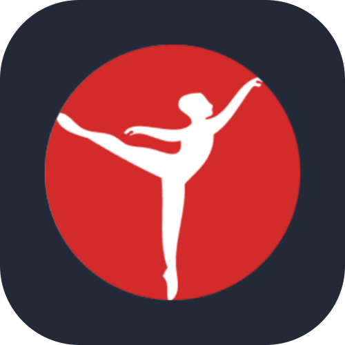
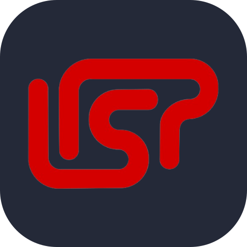

<!-- 

   
  
  
  
  
  

 -->

  <!-- 🗄️ Dados -->
  
  
  
  
  
  
  <!--  -->
  <!-- ☁️ Cloud -->
  
  
  
  <!--  -->
  <!-- 🛠️ Ferramentas de Desenvolvimento -->
  
  
  
  
  
  
   
  <!-- 👨‍💻 Linguagens -->
  
  
  
  
  
  
  
  <!--  -->
  <!-- 🚀 Frameworks e Plataformas -->
  
  
  
  
  <!--  -->
  <!-- 💻 Sistemas Operacionais -->
  
  
  
   
  <!-- 🔎 Ferramentas Forenses -->
  
  
  
  
  

<h3>Data Solutions</h3>

**E.Analytics - Electoral Campaign Intelligence Platform** \
🛠 `Python`, `Airflow`, `SQL`, `PostgreSQL`, `PowerBI`, `DAX`, `ETL/ELT`, `CI/CD` \
📁 [E.Analytics](https://github.com/puc-cc-tcc) \
ℹ️ End-to-end analytics product combining Bourdieu's Social Field Theory with data engineering. Ingests political content, identifies communication styles using AI models, maps symbolic capital, calculates audience adoption, and provides real-time effectiveness metrics via interactive dashboards.
 

**Quati** \
**Python Library** • Data engineering tools to accelerate development. \
🛠 `Python`, `PyPI` \
🐍 [quati](https://pypi.org/project/quati/)
 

<h3>Open Source</h3>

**Igmapper** \
**Python Library** • Get metrics (likes, comms, shares, profiles, posts, reels...) from Instagram. \
🛠 `Python`, `Instagram` \
🐍 [igmapper](https://pypi.org/project/igmapper/)
 

<h3>Academic</h3>

**PUC - Ciência da Computação | Portfolio** \
**Brazil** 🇧🇷 • Projects developed during the bachelor's degree in Computer Science - PUC Minas \
🛠 `Blender`, `C/C++`, `CoppeliaSim`, `Java`, `Lisp`, `Packet Tracer`, `Pascal`, `Prolog`, `Python`, `Shell`

 
<b>Show all...</b>

 **Assembly** (MIPS) [Assembly Inline](https://github.com/lucasoal/puc-ciencia-computacao/tree/main/Assembly/asm-inline) | [Assembly Mips](https://github.com/lucasoal/puc-ciencia-computacao/tree/main/Assembly/asm-mips) | [Assembly](https://github.com/lucasoal/puc-ciencia-computacao/tree/main/Assembly) \
 **Automatons** (JFLAP) [JFLAP Automaton](https://github.com/lucasoal/puc-ciencia-computacao/tree/main/JFLAP-Automatos) | [Stack Automaton](https://github.com/lucasoal/puc-ciencia-computacao/tree/main/JFLAP-Automatos) | [Turing Machine Automaton](https://github.com/lucasoal/puc-ciencia-computacao/tree/main/JFLAP-Automatos) \
 **Blender** [Displacement](https://github.com/lucasoal/puc-ciencia-computacao/tree/main/Blender/Blender-Displacement) | [Normal Maps](https://github.com/lucasoal/puc-ciencia-computacao/tree/main/Blender/Blender-NormalMaps) | [Reflection, Lighting and HDR](https://github.com/lucasoal/puc-ciencia-computacao/tree/main/Blender/Blender-Macaco) | [Texture, Background and Models](https://github.com/lucasoal/puc-ciencia-computacao/tree/main/Blender/Blender-UrsoCanecaBarril) \
 **C** [Encryption and Decryption using Pipes and Water Mark](https://github.com/lucasoal/puc-ciencia-computacao/tree/main/C/C-Pipes) | [Parking Control](https://github.com/lucasoal/puc-ciencia-computacao/tree/main/C/C-Estacionamentos) | [Study](https://github.com/lucasoal/puc-ciencia-computacao/tree/main/C/C-Estudo) \
 **C++** [3D Model Name](https://github.com/lucasoal/puc-ciencia-computacao/tree/main/C++/Cpp-OpenglFreeglutNome3D) | [Soccer Goal](https://github.com/lucasoal/puc-ciencia-computacao/tree/main/C++/Cpp-OpenglFreeglutGol) | [Tic Tac Toe](https://github.com/lucasoal/puc-ciencia-computacao/tree/main/C++/Cpp-OpenglFreeglutTicTacToe) \
 **CoppeliaSim** [Line Tracer](https://github.com/lucasoal/puc-ciencia-computacao/tree/main/CoppeliaSim/line-tracer-Senna-F1-Interlagos-circuit) | [Niryo One - Object Positioning](https://github.com/lucasoal/puc-ciencia-computacao/tree/main/CoppeliaSim/niryo-one-object-positioning.ttt) | [Pionner - Making Circuit](https://github.com/lucasoal/puc-ciencia-computacao/tree/main/CoppeliaSim/pionner-making-circuit-by-sensor-orientation) | [Scara - Rotation 360](https://github.com/lucasoal/puc-ciencia-computacao/tree/main/CoppeliaSim/scara-rotation-360-and-speed-controller.ttt) | [Serial Bot - Three Joint](https://github.com/lucasoal/puc-ciencia-computacao/tree/main/CoppeliaSim/three-joint-serial-robot) \
 **Java** [ADB Interface](https://github.com/lucasoal/java-ADBInterface) | [Android API About Cities](https://github.com/lucasoal/java-AndroidGeodbAPI) | [Bank Current Account](https://github.com/lucasoal/puc-ciencia-computacao/tree/main/Java/bank-current-account) | [Hash Generator](https://github.com/lucasoal/java-GeradorHash) | [Pen OOP](https://github.com/lucasoal/puc-ciencia-computacao/tree/main/Java/poo-study-pen) | [Sort Dessert](https://github.com/lucasoal/puc-ciencia-computacao/tree/main/Java/sorts-dessert) | [Study OOP](https://github.com/lucasoal/puc-ciencia-computacao/tree/main/Java/Java-EstudoPoo) \
 **Lisp** [Lisp Review](https://github.com/lucasoal/puc-ciencia-computacao/tree/main/Lisp/lisp-review.pdf) \
 **Lua** [Max and Min Value of an Array](https://github.com/lucasoal/puc-ciencia-computacao/tree/main/Lua/array-max-min-value.lua) | [Sort Array With BubbleSort Method](https://github.com/lucasoal/puc-ciencia-computacao/tree/main/Lua/bubblesort-array.lua) \
 **Packet Tracer** (Cisco) [LED Communication between 2 MCUs](https://github.com/lucasoal/puc-ciencia-computacao/tree/main/PacketTracer/PUC%20-%20IOT%20-%2020250827%20-%20Atividade%202%20-%20Comunicação%20entre%20MCUs.pkt) | [Motion Sensor Alarm](https://github.com/lucasoal/puc-ciencia-computacao/tree/main/PacketTracer/motion-sensor.pkt) | [Residencial Automation](https://github.com/lucasoal/puc-ciencia-computacao/tree/main/PacketTracer/sound-detector.pkt) | [Smoke Sensor Alarm](https://github.com/lucasoal/puc-ciencia-computacao/tree/main/PacketTracer/smoke-detector.pkt) | [Sound Sensor Alarm](https://github.com/lucasoal/puc-ciencia-computacao/tree/main/PacketTracer/sound-detector.pkt) \
 **Pascal** [Car Route Matrix](https://github.com/lucasoal/puc-ciencia-computacao/tree/main/Pascal/calculate-route-from-matrix.pas) | [Division by Subtraction](https://github.com/lucasoal/puc-ciencia-computacao/tree/main/Pascal/division-by-subtraction.pas) | [Factorial Recursive](https://github.com/lucasoal/puc-ciencia-computacao/tree/main/Pascal/factorial-with-recursive-function.pas) | [Guess Value](https://github.com/lucasoal/puc-ciencia-computacao/tree/main/Pascal/guess-value.pas) | [Sum Results](https://github.com/lucasoal/puc-ciencia-computacao/tree/main/Pascal/sum-results.pas) \
 **Prolog** [Calculate Gradebook](https://github.com/lucasoal/puc-ciencia-computacao/tree/main/Prolog/calculate-gradebook.pro) | [Count Vowels](https://github.com/lucasoal/puc-ciencia-computacao/tree/main/Prolog/count-vowels-from-list.pro) | [List Translation](https://github.com/lucasoal/puc-ciencia-computacao/tree/main/Prolog/list-based-translation.pro) | [Print List Elements](https://github.com/lucasoal/puc-ciencia-computacao/tree/main/Prolog/print-list-elements.pro) \
 **Python** (Notebooks) [Notebooks](https://github.com/lucasoal/puc-ciencia-computacao/tree/main/Python) \
 **Shell Script** [ARP Mapping](https://github.com/lucasoal/puc-ciencia-computacao/tree/main/ShellScript/network/arp-mapping.sh) | [MTU Identification](https://github.com/lucasoal/puc-ciencia-computacao/tree/main/ShellScript/network/mtu-identification.sh) | [Install Useful & Remove Useless Apps](https://github.com/lucasoal/puc-ciencia-computacao/tree/main/ShellScript/tools/get-useful-rm-useless.sh) | [Study](https://github.com/lucasoal/puc-ciencia-computacao/tree/main/ShellScript/study) \
 **MySQL** [Airport Database](https://github.com/lucasoal/puc-ciencia-computacao/tree/main/SQL/Database-Airport) | [Store Database](https://github.com/lucasoal/puc-ciencia-computacao/tree/main/SQL/Database-Store)

 

**IPG - Engenharia Informática | Portfolio** \
**Portugal** 🇵🇹 • Projects developed during the bachelor's degree in Computer Engineering - IPG \
🛠 `Bootstrap`, `C/C#`, `CSS`, `HTML`, `Haskell`, `Ino`, `JavaScript`, `PL/SQL`, `Salesforce`, `Unity`...

 
<b>Show all...</b>

        [ipg-engenharia-informatica](https://github.com/lucasoal-ipg-ei/ipg-engenharia-informatica) \
 **Bootstrap** [Website – Agency](https://github.com/lucasoal-ipg-ei/ipg-website-agency) \
  **HTML, CSS** [Website – Electrician Services](https://github.com/lucasoal-ipg-ei/ipg-website-electrician) \
 **Salesforce** [Autorepair Shop – Salesforce Manage Website](https://github.com/lucasoal-ipg-ei/ipg-autorepair-shop-salesforce) \
  **Unity, C#** [2D/3D Game – Cockroaches Invaders](https://github.com/lucasoal-ipg-ei/ipg-cockroaches-invaders-game)

