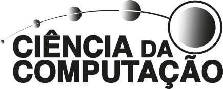

    <picture>
        <source media="(prefers-color-scheme: dark)" srcset="assets/logo/puc-cc-white.svg"> 
    </picture>⠀
    <picture>
        <source media="(prefers-color-scheme: dark)" srcset="assets/logo/puc-white.svg"> 
    </picture>
        

<h1><b>Projects developed during the bachelor's degree in </b> <i> Computer Science - PUC Minas<i></h1>
<h3><a href="https://github.com/lucasoal">@lucasoal</a></h3>

   

### **Short Projects / Tech Study**

-  **Assembly** (MIPS)
    - [Assembly Inline](./Assembly/asm-inline/)
    - [Assembly Mips](./Assembly-Mips/asm-mips/)
    - [Assembly](./Assembly/)
-  **Assembly** (MIPS)
    - [Assembly Inline](./Assembly/asm-inline/)
    - [Assembly Mips](./Assembly-Mips/asm-mips/)
    - [Assembly](./Assembly/)
-  **Automatons** (JFLAP)
    - [JFLAP Automaton](./JFLAP-Automatos)
    - [Stack Automaton](./JFLAP-Automatos)
    - [Turing Machine Automaton](./JFLAP-Automatos)
-  **Blender**
    - [Displacement](./Blender/Blender-Displacement/)
    - [Normal Maps](./Blender/Blender-NormalMaps/)
    - [Reflection, Lighting and HDR](./Blender/Blender-Macaco/)
    - [Texture, Background and Models](./Blender/Blender-UrsoCanecaBarril/)
-  **C**
    - [Encryption and Decryption using Pipes and Water Mark](./C/C-Pipes/)
    - [Parking Control](./C/C-Estacionamentos/)
    - [Study](./C/C-Estudo/)
-  **C++**
    - [3D Model Name](./C++/Cpp-OpenglFreeglutNome3D/)
    - [Soccer Goal](./C++/Cpp-OpenglFreeglutGol/)
    - [Tic Tac Toe](./C++/Cpp-OpenglFreeglutTicTacToe/)
-  **CoppeliaSim**
    - [Line Tracer](./CoppeliaSim/line-tracer-Senna-F1-Interlagos-circuit/)
    - [Niryo One - Object Positioning](./CoppeliaSim/niryo-one-object-positioning.ttt)
    - [Pionner - Making Circuit](./CoppeliaSim/pionner-making-circuit-by-sensor-orientation/)
    - [Scara - Rotation 360](./CoppeliaSim/scara-rotation-360-and-speed-controller.ttt)
    - [Serial Bot - Three Joint](./CoppeliaSim/three-joint-serial-robot/)
-  **Java**
    - [ADB Interface](https://github.com/lucasoal/java-ADBInterface)
    - [Android API About Cities](https://github.com/lucasoal/java-AndroidGeodbAPI)
    - [Bank Current Account](./Java/bank-current-account/)
    - [Cyber Security Lab](https://sites.google.com/view/cyberonelab/pessoas?authuser=0#h.9183b6clno28)
    - [Hash Generator](https://github.com/lucasoal/java-GeradorHash)
    - [Pen OOP](./Java/poo-study-pen/)
    - [Sort Dessert](./Java/sorts-dessert/)
    - [Study OOP](./Java/Java-EstudoPoo/)
-  **Lisp**
    - [Lisp Review](./Lisp/lisp-review.pdf)
-  **Lua**
    - [Max and Min Value of an Array](./Lua/array-max-min-value.lua)
    - [Sort Array With BubbleSort Method](./Lua/bubblesort-array.lua)
-  **Packet Tracer** (Cisco)
    - [LED Communication between 2 MCUs](./PacketTracer/PUC%20-%20IOT%20-%2020250827%20-%20Atividade%202%20-%20Comunicação%20entre%20MCUs.pkt) |
    - [Motion Sensor Alarm](./PacketTracer/motion-sensor.pkt)
    - [Residencial Automation](./PacketTracer/sound-detector.pkt)
    - [Smoke Sensor Alarm](./PacketTracer/smoke-detector.pkt)
    - [Sound Sensor Alarm](./PacketTracer/sound-detector.pkt)
-  **Pascal**
    - [Car Route Matrix](./Pascal/calculate-route-from-matrix.pas)
    - [Division by Subtraction](./Pascal/division-by-subtraction.pas)
    - [Factorial Recursive](./Pascal/factorial-with-recursive-function.pas)
    - [Guess Value](./Pascal/guess-value.pas)
    - [Sum Results](./Pascal/sum-results.pas)
-  **Prolog**
    - [Calculate Gradebook](./Prolog/calculate-gradebook.pro)
    - [Count Vowels](./Prolog/count-vowels-from-list.pro)
    - [List Translation](./Prolog/list-based-translation.pro)
    - [Print List Elements](./Prolog/print-list-elements.pro)
-  **Python** (Notebooks)
    - [CNN & CIFAR10](./Python/CNN_CIFAR10.ipynb)
    - [Churn & ML](./Python/Churn_Modeling_Machine_Learning_Algorithms.ipynb)
    - [Data Analysis](./Python/Data_Analysis.ipynb)
    - [Dataset Preprocessing 1 & 2](./Python/Dataset_Preprocessing.ipynb)
    - [Exploratory Analysis](./Python/Exploratory_Analysis_Descriptive_Statistics_Correlation.ipynb)
    - [Graphical View](./Python/Graphical_View.ipynb)
    - [Intro Python](./Python/Introduction_to_Python_Language.ipynb)
    - [Normal Distribution](./Python/Normal_Probability_Distribution_Model.ipynb)
    - [Pre Processing](./Python/Data_Preprocessing.ipynb)
    - [Probabilistic Models](./Python/Probabilistic_Models.ipynb)
    - [Python Introduction](./Python/Python_Introduction.ipynb)
-  **Shell Script**
    - Network: 
        - [ARP Mapping](./ShellScript/network/arp-mapping.sh)
        - [MTU Identification](./ShellScript/network/mtu-identification.sh)
    - Tools:
        - [Install Useful & Remove Useless Apps](./ShellScript/tools/get-useful-rm-useless.sh)
        - [Study](./ShellScript/study/)
-  **MySQL**
    - [Airport Database](./SQL/Database-Airport/)
    - [Store Database](./SQL/Database-Store/)
